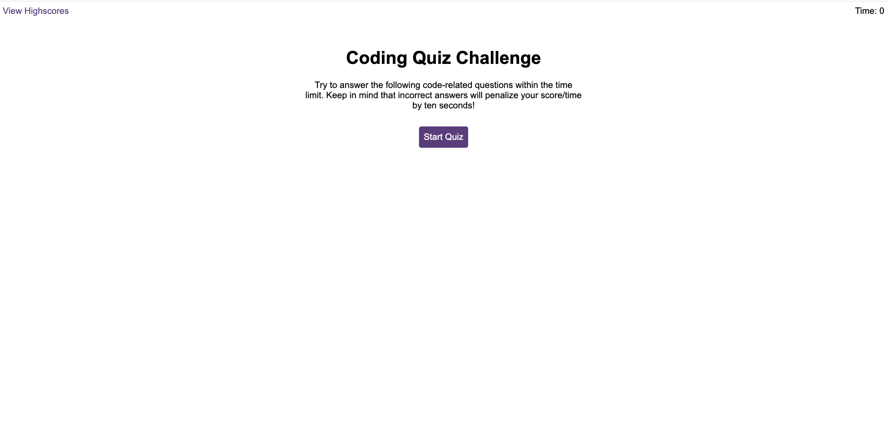
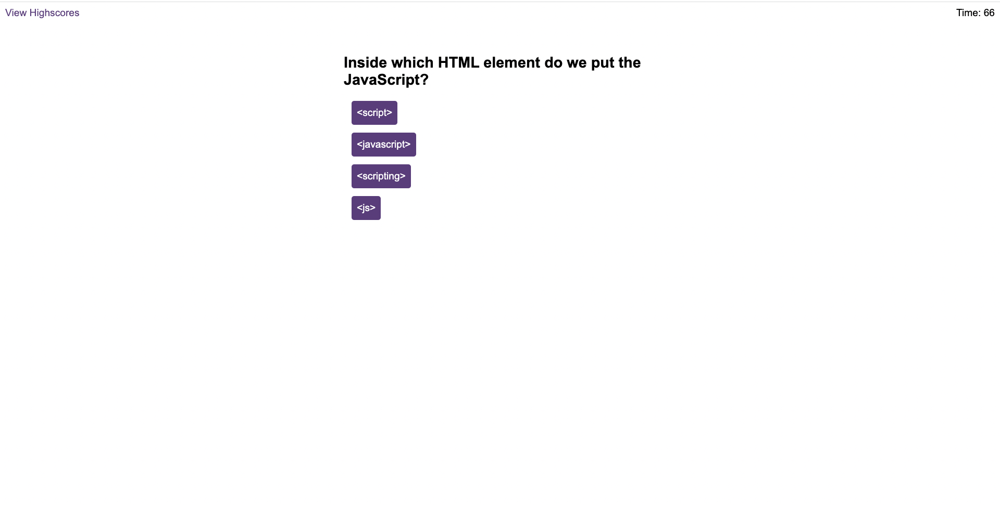
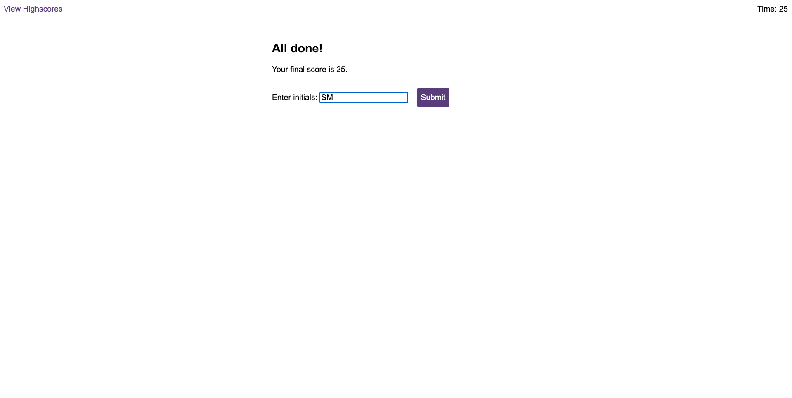
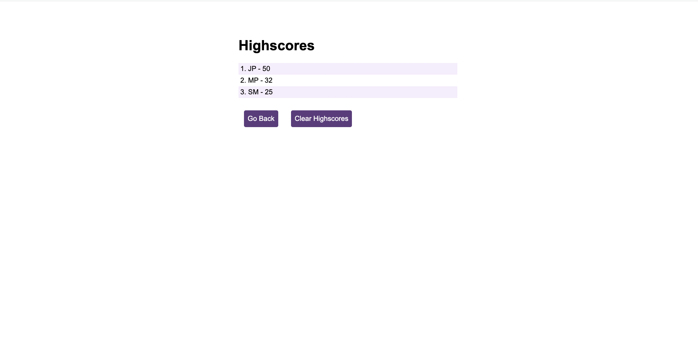

# Timed_Quiz

## Description

Application for a timed quiz on JavaScript fundamentals that stores high scores.

This app will run in the browser, and will feature dynamically updated HTML and CSS powered by JavaScript code.

## Sreenshoot

## Installation

N/A 

## Usage

When the start button is clicked a timer starts and the first question appears.
Questions contain buttons for each answer.When answer is clicked, the next question appears.
If the answer clicked was incorrect then 10 seconds will subtract from the clock

The quiz will end when all questions are answered or the timer reaches 0.

When the game ends, will display the final score and give the user the ability to save their initials and their score. 

The higscores page will show a sorted list of final scores.

## License

The MIT License (MIT)

Copyright (c) 2022 Sabrina Martorelli

Permission is hereby granted, free of charge, to any person obtaining a copy of this software and associated documentation files (the "Software"), to deal in the Software without restriction, including without limitation the rights to use, copy, modify, merge, publish, distribute, sublicense, and/or sell copies of the Software, and to permit persons to whom the Software is furnished to do so, subject to the following conditions:

The above copyright notice and this permission notice shall be included in all copies or substantial portions of the Software.

THE SOFTWARE IS PROVIDED "AS IS", WITHOUT WARRANTY OF ANY KIND, EXPRESS OR IMPLIED, INCLUDING BUT NOT LIMITED TO THE WARRANTIES OF MERCHANTABILITY, FITNESS FOR A PARTICULAR PURPOSE AND NONINFRINGEMENT. IN NO EVENT SHALL THE AUTHORS OR COPYRIGHT HOLDERS BE LIABLE FOR ANY CLAIM, DAMAGES OR OTHER LIABILITY, WHETHER IN AN ACTION OF CONTRACT, TORT OR OTHERWISE, ARISING FROM, OUT OF OR IN CONNECTION WITH THE SOFTWARE OR THE USE OR OTHER DEALINGS IN THE SOFTWARE.

## Deployment link

https://sabrina-martorelli.github.io/Timed_Quiz/
